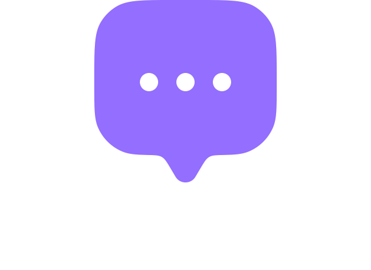

# QuickChat

QuickChat is a modern, full-stack real-time chat application built with React, Node.js, Express, MongoDB, and Socket.io. It features user authentication, real-time messaging, user search, profile management, and image sharing.

## Features

- User authentication (Sign up, Login, JWT-based sessions)
- Real-time messaging with Socket.io
- Search users in the sidebar
- Profile management (update name, bio, and profile picture)
- Image sharing in chat
- Online/offline user status
- Responsive and modern UI with Tailwind CSS

## Tech Stack

- **Frontend:** React, Vite, Tailwind CSS
- **Backend:** Node.js, Express
- **Database:** MongoDB (with Mongoose)
- **Real-time:** Socket.io
- **Image Uploads:** Cloudinary

## Getting Started

### Prerequisites
- Node.js (v18+ recommended)
- MongoDB Atlas account (or local MongoDB)
- Cloudinary account

### Environment Variables
Create a `.env` file in the `server/` directory with the following:
```
PORT=5000
JWT_SECRET=your_jwt_secret
MONGODB_URI=your_mongodb_connection_string
CLOUDINARY_CLOUD_NAME=your_cloudinary_cloud_name
CLOUDINARY_API_KEY=your_cloudinary_api_key
CLOUDINARY_API_SECRET=your_cloudinary_api_secret
```
And in the `client/` directory:
```
VITE_BACKEND_URL='http://localhost:5000'
```

### Installation

1. **Clone the repository:**
   ```sh
   git clone https://github.com/yourusername/quickchat-full-stack.git
   cd quickchat-full-stack
   ```
2. **Install server dependencies:**
   ```sh
   cd server
   npm install
   ```
3. **Install client dependencies:**
   ```sh
   cd ../client
   npm install
   ```

### Running the App

1. **Start the backend server:**
   ```sh
   cd server
   npm start
   ```
2. **Start the frontend dev server:**
   ```sh
   cd ../client
   npm run dev
   ```
3. Open [http://localhost:5173](http://localhost:5173) in your browser.

## Folder Structure

```
QuickChat-Full-Stack/
  client/         # React frontend
  server/         # Express backend
```

## Screenshots



## License

This project is licensed under the MIT License.

---

**Made with ❤️ for learning and chatting!**
